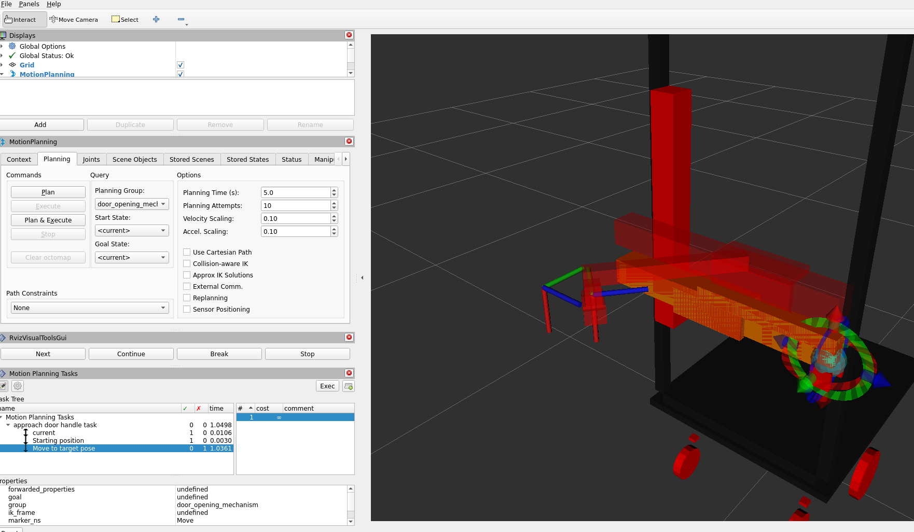

# moveit_issue
This repository contains the code to reproduce the issues we have with moveit.

To reproduce the error you have to follow these steps (probably only works with linux and nvidia gpu):
1. Open this directory in vscode and reopen it in docker container. It will take quiet a while to build the docker.
2. Run `colcon build --symlink-install`
3. Open three terminals and run:
   1. `source install/setup.bash; ros2 launch tiplu_world tiplu_world_launch.py`
   2. `source install/setup.bash; ros2 launch moveit_door_opening_mechanism_rotating_arm_config moveit_launch.py`
   3. `source install/setup.bash; ros2 launch door_opening_mechanism_mtc door_opening_mechanism_mtc_launch.py`
4. Now you should receive these logs in the third terminal:
   
[door_opening_mechanism_mtc-1] [ERROR] [1694610103.345646683] [ompl]: ./src/ompl/geometric/planners/rrt/src/RRTConnect.cpp:252 - door_opening_mechanism/door_opening_mechanism: Unable to sample any valid states for goal tree

[door_opening_mechanism_mtc-1] [WARN] [1694610103.345694384] [moveit.ompl_planning.model_based_planning_context]: Timed out

[door_opening_mechanism_mtc-1] [INFO] [1694610103.379446454] [moveit.ompl_planning.model_based_planning_context]: Unable to solve the planning problem

In rviz you can observe which plan the planner is not able so solve, although the target pose can be reached by hand. Please mind that you can rotate the end effector, so orientation imho is not issue.

Any hint on what the issue could be would be highly appreciated! 